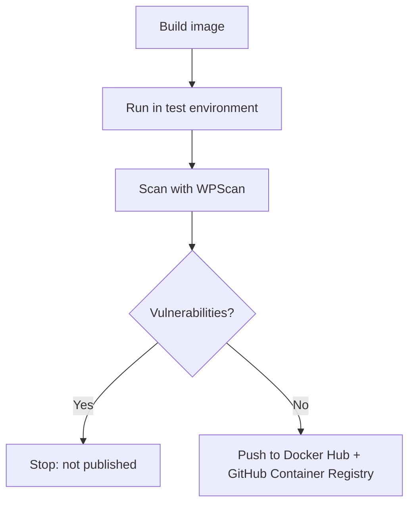

# Automated Vulnerability Scanning Pipeline for WordPress

[](https://github.com/Vladutchi/wordpress-devsecops/actions/workflows/build-scan-push.yml)

A GitHub Actions pipeline that builds a hardened WordPress Docker image, scans it with WPScan, and publishes it to Docker Hub and GitHub Container Registry **only if no vulnerabilities are found**.

## How It Works



1. **Build:** the image is built from [`Dockerfile.hardened`](Dockerfile.hardened).
2. **Test:** it runs together with a MySQL database, and WordPress is installed automatically.
3. **Scan:** WPScan checks the site for known vulnerabilities. The report is saved in [`/scans`](scans).
4. **Publish:** the image is pushed to the registries only if the scan is clean.

## Hardening

| Measure | Purpose |
|---------|---------|
| Latest WordPress version | No known core vulnerabilities |
| Unused plugins and `readme.html` removed | Less attack surface and less information for attackers |
| XML-RPC disabled | Blocks password brute-forcing through `xmlrpc.php` |
| Directory listing disabled | Folder contents can't be browsed |
| Server version hidden | Attackers can't see the exact Apache version |
| Apache runs as a non-root user | Limits damage if the site is compromised |
| `telnet`, `ftp`, `netcat` removed | Fewer tools for an attacker inside the container |

## Results

For comparison, the project includes an outdated WordPress 5.8.3 setup ([`docker/docker-compose.yml`](docker/docker-compose.yml)). Scanning it found **35 known vulnerabilities**, including SQL injection and cross-site scripting, plus exposed version information and an enumerable `admin` user ([`scans/before-scan.txt`](scans/before-scan.txt)).

The hardened image's latest report is in [`scans/scan-result.json`](scans/scan-result.json). The badge above shows whether the latest build passed.

## Run It

```
docker pull vladutchi/wordpress-hardened:latest
```

The pipeline needs these GitHub Secrets: `DOCKER_USERNAME`, `DOCKER_PASSWORD`, `MYSQL_ROOT_PASSWORD`, `MYSQL_DATABASE`, `MYSQL_USER`, `MYSQL_PASSWORD`, `WP_ADMIN_USER`, `WP_ADMIN_PASSWORD`, `WPSCAN_API_TOKEN`.
